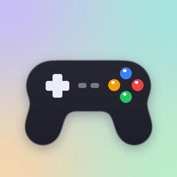

<h1 align="center">EmuSwitch</h1>

<p align="center">
  
</p>

<b>EmuSwitch</b> is an open-source emulator launcher for the Nintendo Switch (homebrew). It plays 3DS
games with its own built-in 3DS emulator, and opens games for other consoles in the emulators that
come bundled with it, all from one menu.

> [!WARNING]
> EmuSwitch is still in testing and doesn't fully work yet. Expect bugs, crashes and games that
> don't run properly.

> [!IMPORTANT]
> EmuSwitch is a legal emulator, we do not distribute any illegal ROMS and we do not condone piracy,
> all ROMS used for testing are ROMS that we have used from our own games.

EmuSwitch is a fork of [Dekopon](https://github.com/PalindromicBreadLoaf/dekopon) by
PalindromicBreadLoaf, which is based on [Azahar](https://github.com/azahar-emu/azahar) (currently
Azahar 2126.1.1). Many thanks to both projects. Please don't report EmuSwitch problems to Azahar or
Dekopon: they have nothing to do with it.

# Consoles

| Console | Runs in | ROM folder |
| --- | --- | --- |
| Nintendo 3DS | EmuSwitch's built-in 3DS emulator | `sdmc:/switch/dekopon/roms/` |
| Nintendo DS | RetroArch (DeSmuME) | `sdmc:/roms/ds/` |
| Game Boy / Game Boy Color | RetroArch (Gambatte) | `sdmc:/roms/gb/` |
| Game Boy Advance | RetroArch (mGBA) | `sdmc:/roms/gba/` |
| NES | RetroArch (Nestopia) | `sdmc:/roms/nes/` |
| Super Nintendo | RetroArch (Snes9x) | `sdmc:/roms/snes/` |
| Nintendo 64 | RetroArch (Mupen64Plus-Next) | `sdmc:/roms/n64/` |
| PlayStation | RetroArch (PCSX ReARMed) | `sdmc:/roms/ps1/` |
| PSP | RetroArch (PPSSPP) | `sdmc:/roms/psp/` |
| PlayStation 2 | ARMSX2-NX | `sdmc:/roms/ps2/` |
| Wii U | Cemu-nx | `sdmc:/roms/wiiu/` |

- Games you own and have dumped yourself go in their console's folder. The 3DS folder can be
  changed in the Paths tab. 3DS CIAs placed in `sdmc:/cias/`, `sdmc:/cia/` or `sdmc:/roms/cia/`
  are installed automatically. They must be decrypted.
- PS2 needs a BIOS dumped from your own console: put the `.bin` or `.zip` in `sdmc:/roms/ps2/`.
- The other consoles' emulators are packed inside EmuSwitch, so there's nothing else to install.

# Features

- **Home** lists your games by console, with box art. Box art is downloaded automatically from the
  libretro thumbnail library while you're online. You can also pick your own pictures from the SD
  card or from SteamGridDB (add your API key in Settings > Advanced).
- **Systems** shows each console and its games. Press `+` on a console to move it.
- Press `+` on a game for **Move Placement**, **Info** and **Delete**. Move Placement can also
  list a game under another console (the D-pad past its section, or `L`/`R`). It still opens in
  its own emulator.
- **42 themes** under Settings > Themes. They colour the menus and the in-game quick menu.
- **Settings** show the settings people change most. Press `X` on any page to see every setting,
  or `Y` to search them all.
- **Per-game settings** for 3DS games (`+` on a game, then Info, then `A`).
- **Updates itself** from inside the app.

3DS features, from Dekopon:
- Full gyro support
- CIA installation support
- Switch software (and hardware) keyboard support
- Multiple screen layouts via R3 (press the right stick)
- Virtual touch input
- Full button remapping support
- In-game menu accessible via `+` and `-`
- Cheat, mod (LayeredFS) and texture-pack support
- System language/region toggle
- Full 3D support via Nintendo Labo VR Kit
- (Virtual) cartridge insertion support
- Resolution upscaling
- Native 1080p output when docked, switching live as the console is docked and undocked
- Amiibo (both real figures and .bin amiibo images placed in `amiibo`)
- Camera support via static images placed in `camera`
- Loading ROMs via USB mass storage
- Save management
- Save states
- Frame generation via LSFG

# Installation

1. Download `EmuSwitch.nro` from the [releases](../../releases) page.
2. Copy it to the `/switch/` folder on your SD card.
3. Launch it from the Homebrew Menu.

EmuSwitch keeps its settings, 3DS saves and logs in `sdmc:/switch/dekopon/`, the same folder
Dekopon uses, so an existing Dekopon setup carries over.

# Updating

Go to **Settings > General > Check for Updates**. EmuSwitch downloads the new version, checks it,
and installs it as it restarts. The previous version is kept next to it as a `.backup` file.

If you're on 3.0.0-RC9 or older, install RC10 by hand once: those versions couldn't replace their
own file while running, so their updater fails with an I/O error.

**Update Channel** (Stable or Prerelease) and **Show What's New** are with the technical settings:
press `X` on Settings > General to show them.

Obviously, this needs a working internet connection.

# Cheats, mods and texture packs

All three use the same folder layout as desktop Azahar/Citra, inside EmuSwitch's folder on your SD
card (`/switch/dekopon/` by default). In every path below, `<TITLE_ID>` is the game's Title ID in
uppercase (e.g. `00040000000EC800`). If you have changed the default path, use yours instead.

## Cheats

- Put a cheat file at `/switch/dekopon/cheats/<TITLE_ID>.txt`. The format is the standard Gateway /
  Action Replay format.
- Open the in-game menu (`+` and `-`) to switch individual cheats on and off while the game runs.
  Your choices are written back to the cheat file, so they persist across launches.

## Mods

Place mod files under `/switch/dekopon/load/mods/<TITLE_ID>/`. Mods are applied when the game boots.

Selecting a mod from a list isn't supported yet. Make sure the folders under the Title ID are
`romfs`, `exefs` and/or `exheader.bin`.

## Texture packs

- Loading: drop a pack in `/switch/dekopon/load/textures/<TITLE_ID>/`, then turn on
  **Custom Textures** in the in-game menu (`+` and `-`). This applies immediately and is remembered.
  For large packs, **Preload Custom Textures** (a technical setting in Settings > Graphics) loads the
  whole pack at boot to avoid in-game hitching, at the cost of more memory. This may run you out of
  RAM, depending on the pack. It's best to use no more than 1080p textures: 4K textures run you out
  of RAM fast for basically no visual gain. You may also run into a crash using many custom textures
  at resolutions above 1x. There are safeguards against this, but it can still happen.
- Dumping: turn on **Dump Textures** (a technical setting in Settings > Graphics). Textures the game
  uses are written to `/switch/dekopon/dump/textures/<TITLE_ID>/`. This takes effect on the next
  launch. It's better done on a PC: performance drops while it's on.

# Save management

Press `+` on a 3DS game on Home, choose **Info**, then press `Y` for the save tools. Inside them:

- `X` makes a new backup of the save currently on the emulated card.
- `A` restores the highlighted backup over the emulated save.
- `Y` deletes the highlighted backup.
- Left/Right switches between save data and extdata, if the title has extdata.

Backups are written to the SD card in Checkpoint's layout, so a real 3DS running Checkpoint reads
them directly and vice versa:

```
sdmc:/3ds/Checkpoint/saves/0x<UNIQUEID> <Title>/<backup name>/
sdmc:/3ds/Checkpoint/extdata/0x<EXTDATAID> <Title>/<backup name>/
```

**Games that use secure values (notably Pokemon games) won't work when copying saves from
EmuSwitch to a 3DS.** Going the other way is fine.

# Loading games from USB storage

EmuSwitch mounts USB mass storage automatically, so drives plugged into the dock (or into the
console) show up without any extra setup. You'll get a notice naming the mount point when one is
inserted, and another when it's removed.

FAT12/16/32, exFAT, NTFS and EXT2/3/4 (recommended) are the supported filesystems.

To use a ROM folder on an external drive, go to the Paths tab and set **second ROM folder** to a
folder on that drive. Please use the second folder for USB. It's rescanned in the background on
each boot, so it's fine to swap drives around.

# LSFG

2/3/4x frame generation is supported via LSFG. You must supply your own Lossless.dll from
[Steam](https://store.steampowered.com/app/993090/Lossless_Scaling/) to use it. Put it at
`sdmc:/switch/dekopon/lsfg/Lossless.dll`. Settings > Graphics > Frame Generation tells you whether
the file was found. This has a very large GPU cost (much more than raising the render resolution),
so expect to overclock the GPU to get good results. 2x is possible in handheld at 460 MHz with a
25% flow scale. The flow scale and the other frame generation options are technical settings:
press `X` on Settings > Graphics to show them.

To enable frame generation, set `Frame Generation` to `On`. In the menu it reads `On: Off`,
because the menu already runs at 60 fps and doesn't need frame generation. The second part is its
current status. In game, it changes to active for games under 60 fps.

The first time, starting a game takes noticeably longer while the frame generation shaders
compile. This only happens once.

There is also an option to raise the multiplier for displays overclocked beyond 60 Hz. It's
untested, and it uses a lot more GPU, so a much higher overclock will be needed.

# Amiibo

You can use your real amiibo figures in games. Go to the `Amiibo` tab in the quick menu and choose
to scan a real amiibo figure. After this, amiibo scanning works as it normally does.

This can corrupt your amiibo, so be safe and keep backups. It hasn't been seen to happen, but it's
possible.

There is one quirk: when saving a new game to an amiibo, you get an error telling you to open the
menu and delete the previously saved data (only one game can live on an amiibo at a time). Keep
holding the amiibo over the NFC touchpoint while you go through the menu to delete it, so the game
can save its own data. It only happens once per new game registered to an amiibo. It's easier to
fully wipe the amiibo beforehand.

# Build instructions

The simplest way to build everything, including the bundled emulators, is the same way the GitHub
workflow does, in Docker:

```shell
git clone --recursive https://github.com/ad3333m/EmuSwitch.git
cd EmuSwitch
docker build -t nxvk externals/nxvk/switch/docker
docker run --rm -v "$PWD:/work" -w /work nxvk bash .ci/switch-nro.sh
```

The finished NRO is `artifacts/EmuSwitch.nro`.

## Building by hand

You need [devkitPro](https://devkitpro.org/wiki/Getting_Started) with these packages:
- switch-dev
- switch-freetype
- switch-bzip2
- switch-libpng
- switch-zlib
- switch-curl
- switch-ntfs-3g and switch-lwext4 *(optional: without them USB drives mount FAT and exFAT only)*

plus `cmake` and `git`.

The GPU backend is Vulkan via [NXVK](https://github.com/PalindromicBreadLoaf/nxvk). Build it first,
following its own documentation, so that `externals/nxvk/switch/build/cross/src/nouveau/vulkan/libnvk.a`
exists. Then:

```shell
cmake -S . -B build/switch \
    -DCMAKE_TOOLCHAIN_FILE=$DEVKITPRO/cmake/Switch.cmake \
    -DCMAKE_BUILD_TYPE=Release \
    -DCMAKE_POLICY_VERSION_MINIMUM=3.5
cmake --build build/switch --target citra_switch_nro -j$(nproc)
```

The NRO is written to `build/switch/src/citra_switch/dekopon.nro`. A build made this way doesn't
include the other consoles' emulators: `.ci/switch-nro.sh` shows where they're downloaded from.

# License and credits

EmuSwitch is GPL-2.0-or-later, like Dekopon and Azahar (`license.txt`). Builds with frame generation
are GPL-3.0-or-later: see [THIRD_PARTY_NOTICES.md](THIRD_PARTY_NOTICES.md). The bundled emulators
keep their own licenses.

- 3DS emulation: [Azahar](https://github.com/azahar-emu/azahar) and
  [Dekopon](https://github.com/PalindromicBreadLoaf/dekopon). If you'd like to support Dekopon's
  development, PalindromicBreadLoaf has a [Ko-fi](https://ko-fi.com/palindromicbreadloaf).
- Vulkan driver: [NXVK](https://github.com/PalindromicBreadLoaf/nxvk)
- PlayStation 2: [ARMSX2-NX](https://github.com/PalindromicBreadLoaf/ARMSX2-NX)
- Wii U: [Cemu-nx](https://github.com/NaGaa95/Cemu-nx)
- DS, Game Boy, GBA, NES, SNES, N64, PlayStation and PSP: [RetroArch](https://www.retroarch.com/)
  with the DeSmuME, Gambatte, mGBA, Nestopia, Snes9x, Mupen64Plus-Next, PCSX ReARMed and PPSSPP cores
- Frame generation: [lsfg-vk](https://github.com/PancakeTAS/lsfg-vk)
